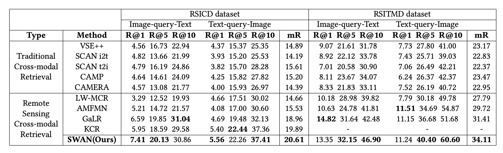

# Reducing Semantic Confusion: Scene-aware Aggregation Network for Remote Sensing Cross-modal Retrieval (ICMR'23 Oral)

By [Jiancheng Pan](https://scholar.google.com/citations?user=nRPD3tAAAAAJ&hl=en&oi=ao), Qing Ma, [Cong Bai](https://scholar.google.com/citations?hl=zh-CN&user=XGZ4UZgAAAAJ&view_op=list_works&sortby=pubdate).

This repo is the official implementation of "[Reducing Semantic Confusion: Scene-aware Aggregation Network for Remote Sensing Cross-modal Retrieval](https://dl.acm.org/doi/abs/10.1145/3591106.3592236)"(ICMR'23 Oral).


[](https://paperswithcode.com/sota/cross-modal-retrieval-on-rsicd?p=reducing-semantic-confusion-scene-aware)
[](https://paperswithcode.com/sota/cross-modal-retrieval-on-rsitmd?p=reducing-semantic-confusion-scene-aware)

- [Reducing Semantic Confusion: Scene-aware Aggregation Network for Remote Sensing Cross-modal Retrieval (ICMR'23 Oral)](#reducing-semantic-confusion-scene-aware-aggregation-network-for-remote-sensing-cross-modal-retrieval-icmr23-oral)
  - [ℹ️ Introduction](#ℹ️-introduction)
  - [🎯 Implementation](#-implementation)
    - [Project Files](#project-files)
    - [Environments](#environments)
    - [Train](#train)
    - [Test](#test)
  - [🌍 Datasets](#-datasets)
  - [📊 Results](#-results)
  - [🙏 Acknowledgement](#-acknowledgement)
  - [📝 Citation](#-citation)

## ℹ️ Introduction

Recently, remote sensing cross-modal retrieval has received incredible attention from researchers. However, the unique nature of remote-sensing images leads to many semantic confusion zones in the semantic space, which greatly affects retrieval performance. We propose a novel scene-aware aggregation network (SWAN) to reduce semantic confusion by improving scene perception capability. In visual representation, a visual multiscale fusion module (VMSF) is presented to fuse visual features with different scales as a visual representation backbone. Meanwhile, a scene fine-grained sensing module (SFGS) is proposed to establish the associations of salient features at different granularity. A scene-aware visual aggregation representation is formed by the visual information generated by these two modules. In textual representation, a textual coarse-grained enhancement module (TCGE) is designed to enhance the semantics of text and to align visual information. Furthermore, as the diversity and differentiation of remote sensing scenes weaken the understanding of scenes, a new metric, namely, scene recall is proposed to measure the perception of scenes by evaluating scene-level retrieval performance, which can also verify the effectiveness of our approach in reducing semantic confusion. By performance comparisons, ablation studies and visualization analysis, we validated the effectiveness and superiority of our approach on two datasets, RSICD and RSITMD.


## 🎯 Implementation
### Project Files
```
.
├── checkpoint
├── data
│   ├── rsicd_precomp
│   └── rsitmd_precomp
├── data.py
├── engine.py
├── fix_data
│   ├── rsicd_precomp
│   └── rsitmd_precomp
├── layers
│   ├── aid_28-rsp-resnet-50-ckpt.pth
│   ├── resnet50-19c8e357.pth
│   ├── resnet.py
│   └── SWAN.py
├── main.py
├── mytools.py
├── README.md
├── save_img_text_emb.py
├── test_ave.py
├── test_local_feature.py
├── test_single.py
├── train.py
├── utils.py
├── vocab
│   ├── rsicd_splits_vocab.json
│   └── rsitmd_splits_vocab.json
└── vocab.py
```
### Environments

```
python==3.8.5
torch==1.11.0
torchvision==0.12.0
```
Notice: Get the Resnet50 pre-training weights under the AID dataset [[Baidu Disk]](https://pan.baidu.com/s/1qDSdcvm6as2rKmAmC_86VA?pwd=86a2)

### Train

```bash
# RSITMD Dataset
python train.py -g 0 -m SWAN -e SWAN --data_name rsitmd  -p checkpoint/ --epochs 50 -kf 1
# RSICD Dataset
python train.py -g 0 -m SWAN -e SWAN --data_name rsicd  -p checkpoint/ --epochs 50 -kf 1
```

### Test

```bash
python test_single.py --resume 'path to model checkpoint'
```

## 🌍 Datasets

All experiments are based on [RSITMD](https://github.com/xiaoyuan1996/AMFMN/tree/master/RSITMD) and [RSICD](https://github.com/201528014227051/RSICD_optimal) datasets, or you can download form [[Baidu Disk]](https://pan.baidu.com/s/1OoBTZ7Hc-S2iCX8nGlbUhA?pwd=pa4k).


## 📊 Results



## 🙏 Acknowledgement

- Basic code to thank [GaLR](https://github.com/xiaoyuan1996/GaLR) by Yuan et al.

## 📝 Citation

If you find this code useful for your work or use it in your project, please cite our paper as:

```
@inproceedings{pan2023reducing,
  title={Reducing Semantic Confusion: Scene-aware Aggregation Network for Remote Sensing Cross-modal Retrieval},
  author={Pan, Jiancheng and Ma, Qing and Bai, Cong},
  booktitle={Proceedings of the 2023 ACM International Conference on Multimedia Retrieval},
  pages={398--406},
  year={2023}
}
```
